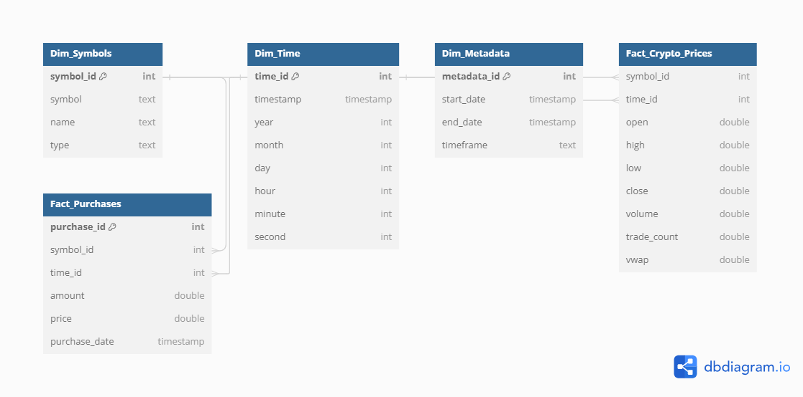

# dbt-dlt-ingestion-pipeline

## 📍 Overview

The dbt-dlt ingestion pipeline project uses dlt (data loading tool) to create a scalable pipeline for loading data into data warehouses. The primary goal is to streamline the ingestion, transformation, and analysis of cryptocurrency trading data using dbt and DuckDB, focusing on data quality and consistency. This project specifically targets cryptocurrency trading data from Alpaca.




### 🔑 Key Points

- **Robust and Scalable**: Designed to handle large volumes of data efficiently.
- **Simplified Data Loading**: Easy integration with modern data stacks and seamless data ingestion process.
- **Data Quality and Consistency**: Ensures high-quality data through robust ETL processes.

This project is tailored for data professionals seeking to enhance their data ingestion and transformation processes, ensuring efficient and reliable data handling for analytical purposes.


## 🎯Purpose

The project aims to efficiently ingest and transform cryptocurrency trading data, making it accessible for analysis and reporting. It provides a reliable and scalable data pipeline to help data professionals turn raw trading data into actionable insights.


### 🌟 Why This Project Stands Out

- **Automated Data Ingestion**: Effortlessly fetch and store cryptocurrency trading data from the [Alpaca API](https://alpaca.markets/docs/api-documentation/).
- **Historical and Simulated Data Analysis**: Analyze historical trading data and generate simulated purchase data to enrich your analyses.
- **Dimensional Modeling and Data Quality**: Organize data into efficient tables and ensure integrity with robust quality tests.
- **Efficient Storage with DuckDB**: Utilize DuckDB for fast and reliable local data storage and querying.
- **Comprehensive Documentation**: Access detailed documentation for easy understanding and maintenance.
- **Seamless Integration**: Compatible with AWS, Google BigQuery, Snowflake, and other modern data stacks.
- **Community-Driven and Customizable**: Engage with dltHub for shared solutions and customize the pipeline to fit your needs.


## 📂 Repository Structure

```plaintext
├── README.md
├── images
├── alpaca_crypto.duckdb
├── dlt_pipeline
│   ├── README.md
│   ├── alpaca_crypto.duckdb
│   ├── alpaca_crypto_dlt_pipeline.py
│   ├── crypto_data_dlt
│   │   ├── __init__.py
│   │   ├── __pycache__
│   │   ├── exceptions.py
│   │   ├── helpers.py
│   │   ├── schemas.py
│   │   └── settings.py
│   └── schemas
│       └── export
├── logs
│   └── dbt.log
├── my_dbt_project
│   ├── README.md
│   ├── analyses
│   ├── dbt_project.yml
│   ├── logs
│   ├── macros
│   ├── models
│   │   ├── clean_crypto_data.sql
│   │   ├── crypto_data.sql
│   │   ├── dim_metadata.sql
│   │   ├── dim_symbols.sql
│   │   ├── dim_time.sql
│   │   ├── distinct_symbols.sql
│   │   ├── fact_crypto_prices.sql
│   │   ├── fact_purchases.sql
│   │   ├── metadata.sql
│   │   ├── purchases.sql
│   │   ├── schema.yml
│   │   └── timestamps.sql
│   ├── profiles.yml
│   ├── seeds
│   ├── snapshots
│   ├── target
│   └── tests
├── requirements.txt
└── scripts
    └── explore_duckdb.py

```


## 🧩 Modules

This project is organized to maintain clear separation of concerns and enhance maintainability. Each module handles a distinct part of the data pipeline.

### ➡️ Data Ingestion

Handles the extraction and loading of cryptocurrency trading data from the Alpaca API using DLT.

**Location**: [`dlt_pipeline`](dlt_pipeline)

**Key Files**:

- `alpaca_crypto_dlt_pipeline.py`: Main script for extracting and loading cryptocurrency data.
- Supporting scripts and configurations:
  - `__init__.py`: Initialization script.
  - `exceptions.py`: Custom exceptions for error handling.
  - `helpers.py`: Utility functions.
  - `schemas.py`: Schema definitions for data validation.
  - `settings.py`: Configuration settings.

### ➡️ Data Transformation

Utilizes dbt (data build tool) and DuckDB for transforming and modeling the ingested data.

**Location**:  [`my_dbt_project`](my_dbt_project)

**Key Files**:

- `dbt_project.yml`: dbt project configuration.
- `models/`: Contains dbt models for various stages of data transformation, such as cleaning crypto data, organizing into fact and dimension tables, and defining data quality tests.

### ➡️ Utility Scripts

Contains additional scripts for data exploration and validation.

**Location**: [`scripts`](scripts)

**Key File**:

- `explore_duckdb.py`: Script to explore and validate data in DuckDB.

### ➡️ Configuration and Logs

Manages project dependencies, configurations, and logs.

**Key Files**:

- `requirements.txt`: Lists the dependencies needed for the project.
- `logs/dbt.log`: Log file for dbt operations.


 ## 🚀 Getting Started

### Prerequisites

Ensure you have the following accounts and tools set up before getting started:

#### Accounts:

- **Alpaca Account**: For accessing cryptocurrency trading data.
- **GitHub Account**: For version control and project collaboration.

#### Installed Tools:

- **Python**: Ensure Python is installed. [Download Python](https://www.python.org/downloads/)
- **dbt (data build tool)**: For data transformation. [Install dbt](https://docs.getdbt.com/docs/installation)
- **DuckDB**: For local data storage and querying. [Download DuckDB](https://duckdb.org/docs/installation)
- **Git**: For version control. [Install Git](https://git-scm.com/book/en/v2/Getting-Started-Installing-Git)
- **VS Code or any IDE**: For code editing. [Download VS Code](https://code.visualstudio.com/)
- **dlt (Data Loading Tool)**: For efficient data ingestion. [Install dlt](https://github.com/dlt-hub/dlt)
- **GitHub Codespaces**: For cloud-based development environments. [Set up GitHub Codespaces](https://github.com/features/codespaces)

### Quick Starter

1. **Clone the Repository**:
   ```sh
   git clone https://github.com/1997mahadi/dbt-dlt-ingestion-pipeline.git
   cd dbt-dlt-ingestion-pipeline
   
2. **Open in GitHub Codespaces**:
   ```sh
   Navigate to your repository on GitHub.
   Click Code > Open with Codespaces.
   
3. **Virtual Environment**:
    ```sh
   python -m venv env
   source env/bin/activate  # On Windows: `env\Scripts\activate`
4. **Install Dependencies**:
   ```sh
   pip install -r requirements.txt
5. **Run the Pipeline**:
    ```sh
    python dlt_pipeline/alpaca_crypto_dlt_pipeline.py
    
6. **Run dbt Models:**:
    ```sh
   dbt debug
   dbt run
   dbt test


## Community and Support

Join the dltHub community for support and collaboration: [dltHub](https://dlthub.com)
