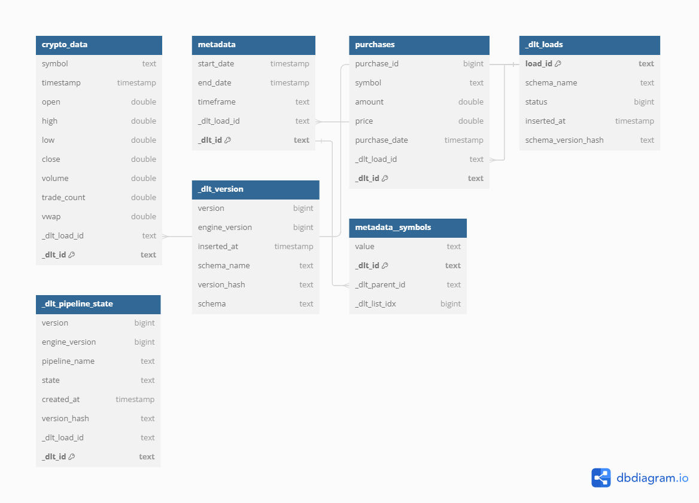

# My DBT Project

This directory contains a DBT (Data Build Tool) project for managing and transforming cryptocurrency data. The project includes various models and tests to ensure data quality and integrity.

## 📊 Data Model

The following diagram represents the data model used in this project, highlighting the various tables and their relationships.

## 📄 Overview

This project aims to transform and analyze cryptocurrency data. It includes models for raw data, metadata, and purchase data. The project utilizes DBT to ensure data quality and maintainability.

### Models

- **clean_crypto_data.sql**: Model to clean and transform raw cryptocurrency data.
- **crypto_data.sql**: Model for raw cryptocurrency trading data.
- **dim_metadata.sql**: Dimensional table for metadata about the data load.
- **dim_symbols.sql**: Dimensional table for cryptocurrency symbols.
- **dim_time.sql**: Dimensional table for time attributes (optional).
- **distinct_symbols.sql**: Model to extract distinct cryptocurrency symbols.
- **fact_crypto_prices.sql**: Fact table for cryptocurrency prices.
- **fact_purchases.sql**: Fact table for cryptocurrency purchases.
- **metadata.sql**: Model for metadata about the data load period.
- **purchases.sql**: Model for purchase details of cryptocurrencies.
- **timestamps.sql**: Model for time attributes.

### Data Quality Tests

This project includes various tests to ensure data quality, such as:

- Not null tests for critical fields.
- Unique tests for primary keys.
- Relationships tests to ensure referential integrity.

## 🚀 Getting Started

To get started with this project, follow these steps:

1. Clone the repository: `git clone https://github.com/1997mahadi/dbt-dlt-ingestion-pipeline`
2. Navigate to the project directory: `cd my_dbt_project`
3. Install dependencies: `pip install -r requirements.txt`
4. Run DBT models: `dbt run`
5. Run data quality tests: `dbt test`

## 📚 Additional Resources

For more information on DBT and how to use it, refer to the [DBT documentation](https://docs.getdbt.com/).

---

Feel free to reach out if you have any questions or need further assistance!
